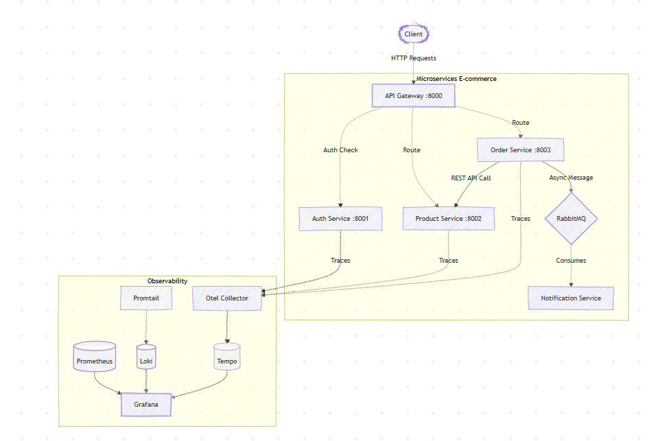
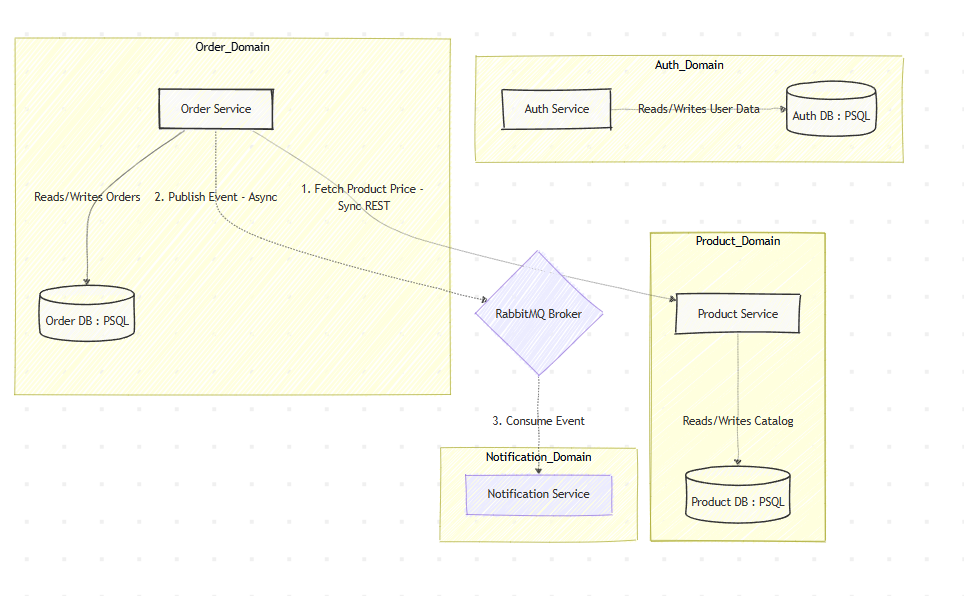
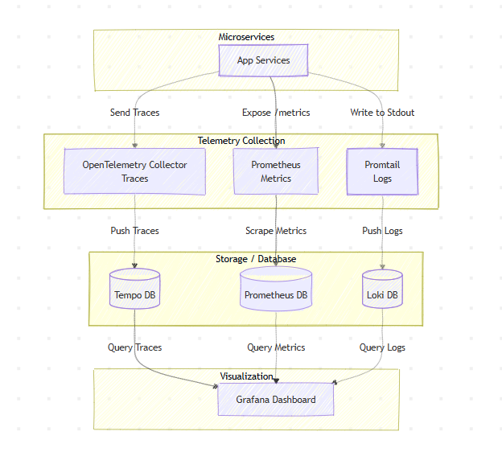

# Go Microservices E-commerce Platform

A scalable, event-driven E-commerce backend built with **Go (Golang)**, structured around the microservices architecture. It features an API Gateway for centralized routing, JWT-based authentication, async messaging with RabbitMQ, and a comprehensive OpenTelemetry observability stack.

## 🚀 Technologies Used
* **Languages:** Go (Golang)
* **API Gateway & Routing:** `go-chi/chi`
* **Messaging / Event Broker:** RabbitMQ
* **Databases:** PostgreSQL / SQLite
* **Observability:** OpenTelemetry (Otel), Prometheus, Loki, Promtail, Tempo, Grafana
* **Deployment:** Docker, Docker Compose, Kubernetes

---

## 🏗️ Architecture & System Design

### 1. Total Architecture
The system consists of independent microservices handling specific domains. The **API Gateway** acts as the central entry point, routing requests to the respective services.



### 2. Authentication Flow (API Gateway)
We use a centralized authentication approach at the API Gateway level. The gateway validates JWTs internally and forwards the authenticated user's email via the `X-User-Email` header to internal services.


### 3. Database Per Service Pattern
To ensure true decoupling and statelessness, each microservice manages its own database. Data consistency across services is maintained eventually using asynchronous event publishing.



### 4. Asynchronous Messaging (RabbitMQ)
Synchronous requests are kept to a minimum. For example, when an order is created, the Order Service publishes an `OrderCreated` event to RabbitMQ, which the Notification Service consumes in the background.


### 5. Single Microservice Internal Structure
Each Go microservice is structured cleanly separating Handlers, Services (Business Logic), and Repositories (Data Access).


### 6. Observability Stack
The platform uses the LGTM stack (Loki, Grafana, Tempo) + Prometheus. Services emit traces, logs, and metrics to the Otel Collector and Promtail, which are visualized in Grafana.



### 7. Kubernetes Deployment
The production deployment utilizes Kubernetes, mapping services to K8s Deployments/Services, databases to StatefulSets, and managing external traffic via an Ingress Controller.


---

## 🚦 How to Get Started

### Prerequisites
- Docker & Docker Compose
- Go 1.21+ (For local development)

### 1. Initialize Go Workspace (Local Dev)
The project uses Go Workspaces. If not already initialized, run:
```bash
go work init ./authservice ./productservice ./apigateway ./orderservice ./notificationservice ./shared
```

### 2. Start the Infrastructure (Docker)
Start RabbitMQ and the entire Observability stack (Prometheus, Loki, Tempo, Grafana) using Docker Compose:
```bash
docker-compose -f docker-compose/docker-compose.yml up -d
```
*(Alternatively, navigate to the `docker-compose` folder and run `docker-compose up -d`)*

### 3. Run the Microservices
You can run the microservices locally using the provided shell script or start them manually.
Using the script:
```bash
./run.sh
```

Or manually in separate terminals:
```bash
# Terminal 1: Auth Service (Port 8001)
cd authservice && go run main.go

# Terminal 2: Product Service (Port 8002)
cd productservice && go run main.go

# Terminal 3: Order Service (Port 8003)
cd orderservice && go run main.go

# Terminal 4: Notification Service
cd notificationservice && go run main.go

# Terminal 5: API Gateway (Port 8000)
cd apigateway && go run main.go
```

### 4. Testing the APIs
You can test the entire flow (Auth, Products, and Orders) using the provided Bash script. The script automatically handles hitting the **API Gateway** on `http://localhost:8000`, authenticating, extracting the JWT token, and using it for protected routes.

Run the test script from your terminal (Git Bash, WSL, or Linux/macOS):
```bash
bash check_all_curl.sh
```

- **Grafana Dashboard:** `http://localhost:3000`
- **RabbitMQ UI:** `http://localhost:15672` (guest / guest)
